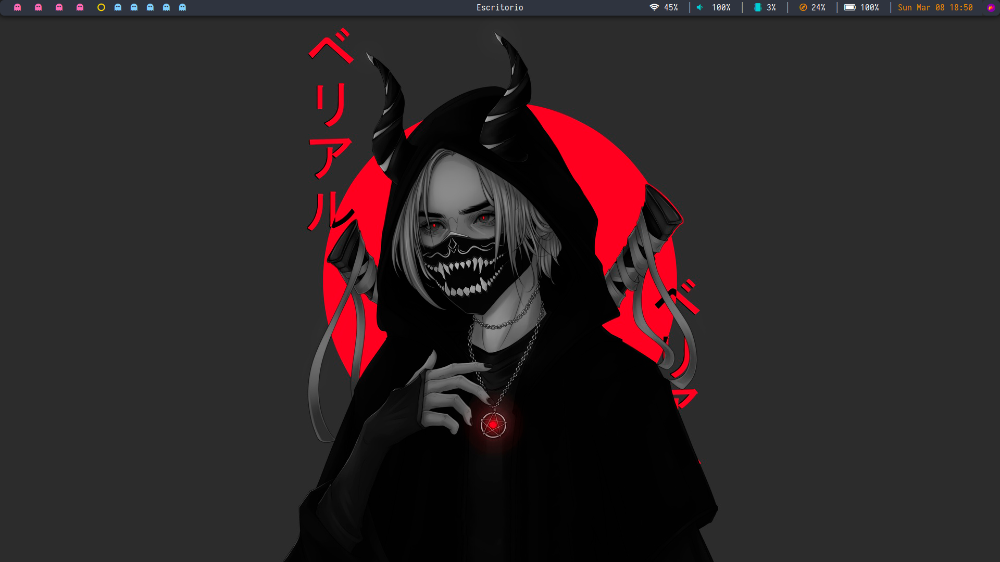
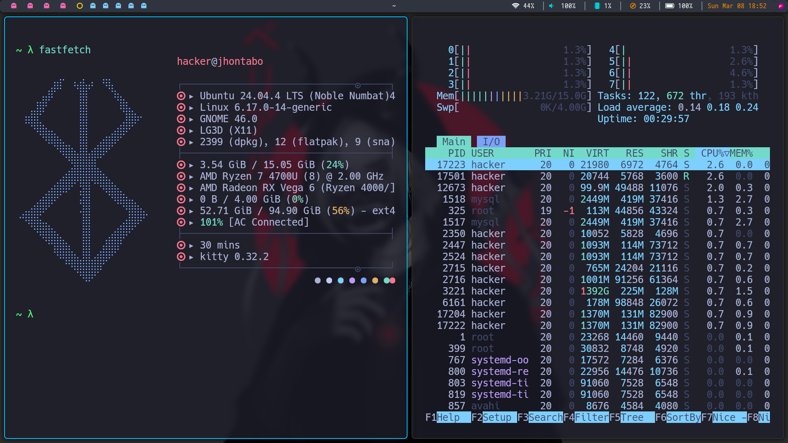
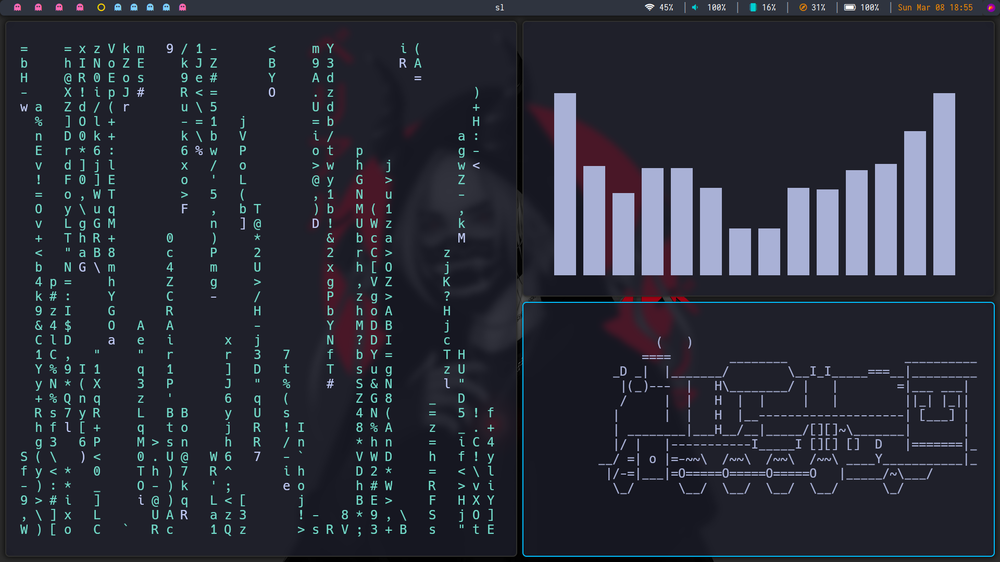
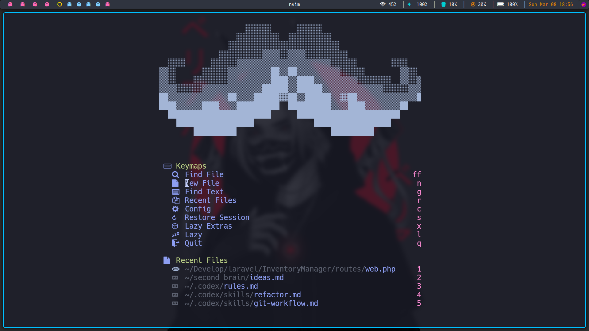

# ubuntuBspwm

Pacman/arcade-themed BSPWM dotfiles for Ubuntu/Debian, with an automated installer and a full desktop setup (BSPWM, SXHKD, Polybar, Picom, Kitty, Rofi, Zsh + Powerlevel10k, custom scripts, wallpapers, and fonts).

## Desktop Preview






## Features

- BSPWM + SXHKD tiling setup
- Polybar and Picom preconfigured
- Kitty + Rofi themed configuration
- Zsh with Powerlevel10k
- Included custom scripts (`screenshot`, `whichSystem.py`, polybar helpers)
- Built-in wallpaper and font collection
- One-command installer for Ubuntu/Desktop and Ubuntu/Server scenarios

## Requirements

- Debian/Ubuntu-based distro
- `sudo` access
- Internet connection for package installation

## Installation

```bash
git clone https://github.com/Jhontabo/ubuntuBspwm.git
cd ubuntuBspwm
chmod +x install.sh
./install.sh
```

## Uninstall

```bash
cd ubuntuBspwm
chmod +x uninstall.sh
./uninstall.sh
```

## What `install.sh` Does

- Installs required packages (BSPWM, SXHKD, Polybar, Picom, Kitty, Rofi, Zsh, etc.)
- Adds LightDM automatically if no display manager is detected
- Copies repo configs to `~/.config`
- Installs wallpapers to `~/Wallpaper`
- Installs included fonts to `~/.local/share/fonts`
- Installs helper scripts to `/usr/local/bin`
- Configures Zsh + Powerlevel10k
- Creates backups of existing configs before replacing them

## Repository Structure

```text
ubuntuBspwm/
├── Config/          # bspwm, sxhkd, polybar, picom, kitty, and helper configs
├── Components/      # extra components (e.g., lockscreen assets)
├── fonts/           # bundled fonts
├── kitty/           # extra kitty config files
├── rofi/            # rofi config and themes
├── scripts/         # utility scripts
├── screenshots/     # desktop preview images used in README
├── Wallpaper/       # wallpaper collection
├── install.sh       # main installer
├── uninstall.sh     # uninstall helper (removes files + restores latest backup)
├── sync.sh          # sync helper
├── .zshrc
└── .p10k.zsh
```

## Post-Install

1. Log out and select **BSPWM** from your login manager.
2. If you installed on Ubuntu Server, enable LightDM:
   `sudo systemctl enable --now lightdm`
3. Verify core tools:
   `bspwm --version && sxhkd -v && polybar --version && picom --version`

## Credits

- Original concept based on [ZLCubewm](https://github.com/ZLCubewm)
- Theme style inspired by Kali/arcade aesthetics
